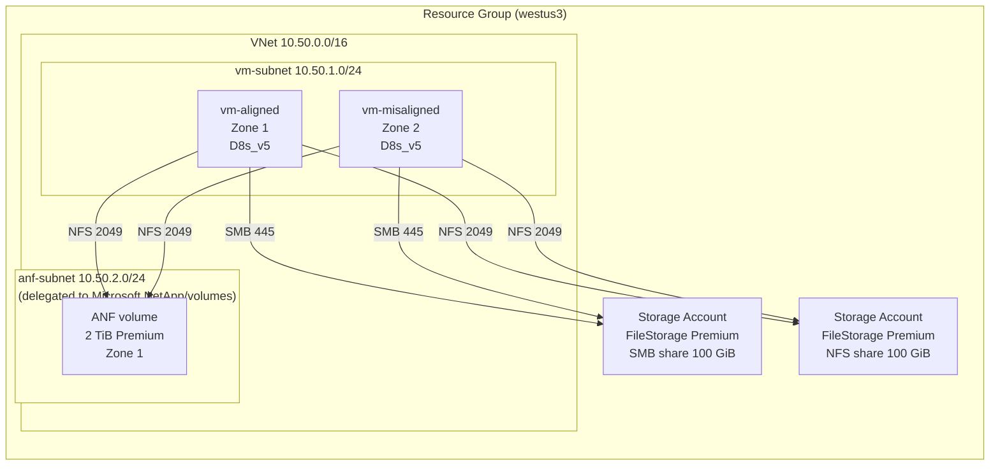

# Azure Shared Storage IOPS Test Lab (VM-based)

Reproduces a real-world Azure shared-storage benchmark using **two Linux VMs**
instead of AKS, so you can directly compare IOPS across three shared-storage
options and see the **zone-affinity** behaviour reported with Azure NetApp
Files (ANF).

> A full write-up of the results from one run of this lab is in
> [Storage-CrossZone-Findings.md](Storage-CrossZone-Findings.md).

Shares under test (all mounted into the same VM):

| Mount point      | Backend                 |
|------------------|-------------------------|
| `/mnt/fileshare` | Azure Files **SMB** (Premium) |
| `/mnt/nfsshare`  | Azure Files **NFS** (Premium) |
| `/mnt/netapp`    | Azure NetApp Files **NFS** (Premium, zonal) |

Two VMs are deployed:

| VM            | Zone | Purpose |
|---------------|------|---------|
| `vm-aligned`     | 1 (same zone as ANF) | "Best case" — aligned-node test |
| `vm-misaligned`  | 2 (different zone)   | "Worst case" — cross-zone test |

You run the **same `fio` commands** on both VMs and compare.

---

## Architecture



---

## Prerequisites

- An Azure subscription (Owner or Contributor on the target subscription).
- Azure CLI installed (`az --version` >= 2.55) and logged in: `az login`.
- A region where **Azure NetApp Files supports availability zones**.
  Default is `westus3`.
- An SSH public key. If you don't have one:
  ```powershell
  ssh-keygen -t ed25519 -f $HOME\.ssh\anf_lab -N '""'
  ```
- The Azure NetApp Files resource provider registered **and** your subscription
  onboarded for ANF. The deploy script does the registration; onboarding (if
  required) must be done once via the [ANF waitlist](https://learn.microsoft.com/azure/azure-netapp-files/azure-netapp-files-register).

> **Heads up:** Azure NetApp Files capacity-pool + volume creation takes
> ~10–15 minutes. Total deployment is ~15–20 minutes.

---

## 1. Deploy the lab

### Option A — PowerShell (Windows)

```powershell
cd .\infra
.\deploy.ps1 `
    -SubscriptionId "<your-sub-id>" `
    -Location "westus3" `
    -ResourceGroup "rg-storage-iops-lab" `
    -SshPublicKeyPath "$HOME\.ssh\anf_lab.pub" `
    -SshSourceAddressPrefix "$((Invoke-RestMethod https://api.ipify.org))/32"
```

### Option B — Bash (WSL / Cloud Shell / macOS)

```bash
cd infra
./deploy.sh \
    --subscription "<your-sub-id>" \
    --location westus3 \
    --resource-group rg-storage-iops-lab \
    --ssh-public-key "$HOME/.ssh/anf_lab.pub" \
    --ssh-source "$(curl -s https://api.ipify.org)/32"
```

What it does:
1. Registers `Microsoft.NetApp` and `Microsoft.Storage` providers if needed.
2. Creates the resource group.
3. Deploys [`main.bicep`](infra/main.bicep) which provisions:
   - VNet + 2 subnets (VM subnet with `Microsoft.Storage` service endpoint;
     ANF subnet delegated to `Microsoft.NetApp/volumes`).
   - NSG allowing SSH only from `SshSourceAddressPrefix`.
   - Two Linux VMs (`vm-aligned` in zone 1, `vm-misaligned` in zone 2),
     Ubuntu 22.04 LTS, `Standard_D8s_v5`.
   - Two Premium **FileStorage** accounts — one with an SMB share, one with
     an NFS share, both locked down to the VNet.
   - An ANF account, capacity pool (4 TiB Premium), and 2 TiB NFSv4.1 volume
     pinned to zone 1.
4. Prints the public IPs of both VMs and the share connection info.

When the script finishes it writes `lab-output.json` with everything you need
for the next step.

---

## 2. Configure the VMs (mount the three shares)

The script `scripts/setup-vm.sh` installs `cifs-utils`, `nfs-common`, `fio`,
and mounts all three shares. The deploy script copies it to both VMs and
prints the exact commands to run; e.g.:

```powershell
# From your workstation
$out = Get-Content .\infra\lab-output.json | ConvertFrom-Json

# Aligned VM
ssh -i $HOME\.ssh\anf_lab azureuser@$($out.alignedVmIp) `
    "sudo bash /tmp/setup-vm.sh '$($out.smbAccount)' '$($out.smbKey)' '$($out.nfsAccount)' '$($out.anfMountIp)' '$($out.anfMountPath)'"

# Misaligned VM
ssh -i $HOME\.ssh\anf_lab azureuser@$($out.misalignedVmIp) `
    "sudo bash /tmp/setup-vm.sh '$($out.smbAccount)' '$($out.smbKey)' '$($out.nfsAccount)' '$($out.anfMountIp)' '$($out.anfMountPath)'"
```

After it runs, verify on each VM:

```bash
df -hT | grep -E 'cifs|nfs'
# /mnt/fileshare  cifs    100G   ...
# /mnt/nfsshare   nfs4    100G   ...
# /mnt/netapp     nfs4    2.0T   ...
```

---

## 3. Run the IOPS tests

`scripts/run-fio-tests.sh` runs the standard 4 KiB random-mix `fio` command
against each of the three mounts and prints a clean side-by-side summary.
It also runs an optional sustained 60-second version so you can see
steady-state behaviour (the `--size=1M` burst test alone does not).

```powershell
# Aligned VM (expect ~3000-3500 read IOPS / ~1000-1200 write IOPS on ANF)
ssh -i $HOME\.ssh\anf_lab azureuser@$($out.alignedVmIp) `
    "bash /tmp/run-fio-tests.sh" | Tee-Object .\results-aligned.txt

# Misaligned VM (expect ~1/3 of the above on ANF)
ssh -i $HOME\.ssh\anf_lab azureuser@$($out.misalignedVmIp) `
    "bash /tmp/run-fio-tests.sh" | Tee-Object .\results-misaligned.txt
```

The exact command being run, per mount:

```bash
fio --randrepeat=1 --direct=1 --gtod_reduce=1 --name=test \
    --filename=/mnt/<share>/storage/rrw.fio \
    --bs=4k --iodepth=64 --size=1M \
    --readwrite=randrw --rwmixread=75
```

The sustained variant (added by the script) runs the same workload but with
`--size=4G --runtime=60 --time_based --numjobs=4 --group_reporting`, which
better reflects real database I/O.

### What you should see

| Workload                | Aligned VM (zone 1)        | Misaligned VM (zone 2)     |
|-------------------------|----------------------------|----------------------------|
| Azure Files **SMB**     | ~250–350 read / ~80–110 write IOPS | ~250–350 / ~80–110 (similar) |
| Azure Files **NFS**     | ~260–340 read / ~85–110 write IOPS | ~260–340 / ~85–110 (similar) |
| Azure NetApp Files NFS  | **~3000–3500 read / ~1000–1200 write IOPS** | ~800–1100 read / ~270–330 write IOPS (~⅓) |

The headline finding should reproduce: **only ANF gives a big IOPS jump,
and only when the client VM is in the same zone as the ANF volume.** Azure
Files is roughly zone-insensitive at this size because the share itself
isn't zone-pinned the same way.

---

## 4. Vary the disk size (optional)

If you need to compare 2 TB / 3 TB / 5 TB ANF volumes, re-deploy with a
different volume size:

```powershell
.\deploy.ps1 -SubscriptionId "..." -ResourceGroup rg-storage-iops-lab `
    -AnfVolumeSizeGiB 3072        # 3 TiB
# or
    -AnfVolumeSizeGiB 5120        # 5 TiB (bump pool too)
    -AnfPoolSizeTiB 8
```

ANF throughput on the **Premium** tier scales at 64 MiB/s per TiB, so
the larger the volume the more headroom the test has. For the 4 KiB
random-mix `fio` workload used here, IOPS does not scale 1:1 with capacity
once you're past the burst — that's why the sustained test in the script
is useful for the sizing decision.

---

## 5. Tear down

```powershell
.\scripts\cleanup.ps1 -ResourceGroup rg-storage-iops-lab
```

or

```bash
./scripts/cleanup.sh rg-storage-iops-lab
```

This deletes the resource group and everything in it.

---

## File layout

```
storage-iops-test/
├── README.md
├── Storage-CrossZone-Findings.md   # full lab report from one run
├── infra/
│   ├── main.bicep              # full lab infra (VNet, VMs, Files, ANF)
│   ├── main.parameters.json    # template parameters
│   ├── deploy.ps1              # Windows deployment
│   └── deploy.sh               # bash deployment
└── scripts/
    ├── setup-vm.sh             # installs tools + mounts 3 shares
    ├── run-fio-tests.sh        # standard fio + sustained variant
    ├── cleanup.ps1
    └── cleanup.sh
```
