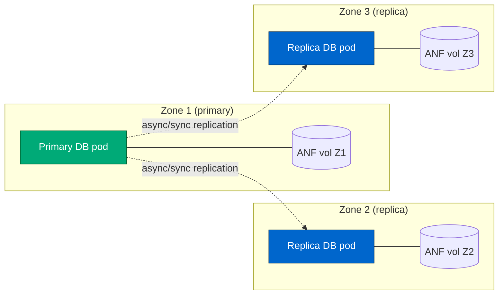
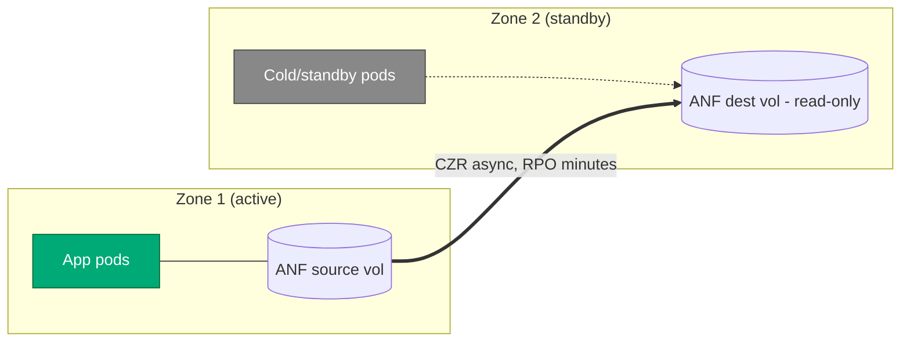

# Azure Shared Storage IOPS — Cross-Zone Investigation

**Purpose:** Reproduce and quantify the cross-availability-zone behaviour
of **Azure NetApp Files (ANF)** and compare it against **Azure Files (NFS)**,
based on a reported field observation that ANF performs *"~3× worse when
the client VM is not in the same zone as the ANF volume"*.

| Field | Value |
|---|---|
| Date | 2026-06 |
| Region | `westus3` |
| Subscription | Standard subscription (RegistrationRequired policy applies for ANF) |
| Resource group | `rg-storage-iops-lab` |
| Execution method | `az vm run-command invoke` (SSH blocked by tenant Azure Policy) |

---

## 1. Lab Setup

### 1.1 Topology

```
Region: westus3
└── Resource group: rg-storage-iops-lab
    ├── VNet storage-lab-vnet (10.50.0.0/16)
    │   ├── vm-subnet      10.50.1.0/24  (Microsoft.Storage service endpoint)
    │   │     ├── vm-aligned     — Zone 1
    │   │     ├── vm-misaligned  — Zone 2
    │   │     └── vm-z3          — Zone 3
    │   └── anf-subnet     10.50.2.0/24  (delegated to Microsoft.NetApp/volumes)
    │         └── ANF volume vol1 — Zone 1 (mount IP 10.50.2.4)
    │
    ├── Storage account <smb-sa-name>   (FileStorage Premium, SMB share "storage" 100 GiB)
    ├── Storage account <nfs-sa-name>   (FileStorage Premium, NFS share "storage" 100 GiB)
    └── ANF account + 4 TiB Premium capacity pool + 2 TiB NFSv4.1 volume (Zone 1)
```

### 1.2 Virtual machines

All three VMs are identical hardware so any IOPS difference is attributable
to the **network path to storage**, not to the VM SKU.

| VM | Zone | ANF zone | Relationship to ANF | SKU | OS | Private IP |
|---|---|---|---|---|---|---|
| `vm-aligned`    | **1** | 1 | **Aligned** (same zone, intra-datacenter) | Standard_D8s_v5 | Ubuntu 24.04 LTS | 10.50.1.4 |
| `vm-misaligned` | **2** | 1 | **Cross-zone** (different datacenter, same region) | Standard_D8s_v5 | Ubuntu 24.04 LTS | 10.50.1.5 |
| `vm-z3`         | **3** | 1 | **Cross-zone** (different datacenter, same region) | Standard_D8s_v5 | Ubuntu 24.04 LTS | 10.50.1.6 |

**Why three VMs?** vm-aligned establishes the best-case baseline. vm-misaligned
and vm-z3 let us see whether the cross-zone penalty is consistent (i.e. is
the gap "zone 1 vs everything else" or does each cross-zone hop behave
differently?).

### 1.3 Storage under test

| Backend | Type | Mount on VM | Zonal? | Notes |
|---|---|---|---|---|
| Azure Files (SMB) | Premium FileStorage | `/mnt/fileshare` (cifs) | No — regional endpoint | Excluded from this run — tenant policy `allowSharedKeyAccess=false` cannot be flipped, so SMB authentication was not possible |
| Azure Files (NFS) | Premium FileStorage | `/mnt/nfsshare` (nfs4) | No — regional endpoint | Works without storage account keys (uses VNet ACL) |
| **Azure NetApp Files** | Premium 4 TiB pool / 2 TiB NFSv4.1 volume | `/mnt/netapp` (nfs4) | **Yes — pinned to Zone 1** | Mount IP `10.50.2.4`, path `vol1` |

### 1.4 NFS mount options used

Identical on every VM, every mount, so any IOPS gap is purely network/storage:

```
vers=4.1,sec=sys,nconnect=8,rsize=262144,wsize=262144,hard,timeo=600,retrans=2
```

`nconnect=8` opens 8 parallel TCP connections to the NFS endpoint, which is
the recommended setting for ANF to actually drive its throughput. Without
it a single TCP stream becomes the bottleneck.

### 1.5 Why the network path matters

* **Same-zone (aligned):** VM → ToR switch → rack-local storage front-end.
  Round-trip is sub-millisecond (~0.2 ms typical).
* **Cross-zone (misaligned):** VM → ToR → zone aggregation → inter-zone
  backbone → other zone aggregation → ToR → storage front-end.
  Round-trip is ~1–2 ms typical.

For a **4 KiB synchronous random workload**, IOPS is bounded by `iodepth / RTT`
because each I/O can only complete after one network round-trip. That's why
the cross-zone hit on ANF is not "a little slower" — it's a different IOPS
regime.

Azure Files (both SMB and NFS) does **not** show this behavior, because the
share's front-end is reached through a regional load-balanced endpoint that
isn't pinned to one zone. There's no "aligned" vs "misaligned" path to test.

---

## 2. Tests Performed

### 2.1 Test 1 — Reproduce the reported benchmark (burst)

This is the `fio` command as originally reported:

```bash
fio --randrepeat=1 --direct=1 --gtod_reduce=1 --name=test \
    --filename=/mnt/<share>/storage/rrw.fio \
    --bs=4k --iodepth=64 --size=1M \
    --readwrite=randrw --rwmixread=75
```

* 4 KiB block size, direct I/O (bypasses OS cache)
* iodepth 64 (queue 64 I/Os to the storage)
* `--size=1M` → only 1 MB of work, completes in milliseconds — essentially
  measures **burst** IOPS, not steady-state
* 75 % random reads, 25 % random writes (reported workload mix)

Run on every VM × every accessible mount.

### 2.2 Test 2 — Sustained workload (steady-state)

Same fio command but expanded to actually exercise the storage for a real
duration:

```bash
fio --randrepeat=1 --direct=1 --name=test \
    --filename=/mnt/<share>/storage/rrw.fio \
    --bs=4k --iodepth=64 --size=4G --runtime=60 --time_based \
    --numjobs=4 --group_reporting \
    --readwrite=randrw --rwmixread=75
```

Difference vs Test 1:
* `--size=4G --runtime=60 --time_based` — runs for a full 60 seconds against
  a 4 GiB working set
* `--numjobs=4 --group_reporting` — 4 parallel worker threads, results
  aggregated (more realistic for a database / app server)

This is the number you should quote when sizing for production, because the
burst test (Test 1) doesn't last long enough to hit the sustained-throughput
governor that ANF actually applies.

### 2.3 Test 3 — Cross-zone deep dive on ANF

To validate the reported "3× cross-zone penalty" claim with statistical
confidence, ANF is then tested on all three VMs with two passes:

**3a. Repeatability check** — the sustained config (iodepth=64, 4 jobs,
30 s) is run **three times in a row** on each VM. This shows whether the
numbers are stable, or whether the gap is just noise.

**3b. Iodepth sweep** — the same workload is run at iodepth = **1, 4, 16,
64, 256** (4 jobs each, 30 s each) on every VM. This separates two
regimes:

* At low iodepth (1, 4) the workload is **latency-bound** — IOPS = `iodepth / RTT`.
  This is where the cross-zone penalty is largest, because every extra
  millisecond of RTT directly limits throughput.
* At high iodepth (64, 256) the workload becomes **bandwidth-bound** — the
  storage back-end is the bottleneck, not the network. Cross-zone and
  aligned should converge.

Both passes also capture **mean latency** from fio's JSON output (parsed via
`jq`). The latency numbers are the proof of *why* cross-zone is slower —
they let us correlate `Δlatency ≈ inter-zone RTT`.

### 2.4 What we are *not* testing in this run

* **SMB** on Azure Files — blocked by tenant `allowSharedKeyAccess=false` policy.
  Same protocol comparison (NFS on both backends) is actually cleaner anyway.
* **Volume size sweep** (2 / 3 / 5 TiB) — ANF Premium scales at 64 MiB/s per
  TiB, but for 4 KiB random I/O this matters less than network latency.
  Can be added later by changing the Bicep parameter.
* **Other VM SKUs / accelerated networking variants** — current SKU
  (`D8s_v5`) has accelerated networking on by default; not the bottleneck.

---

## 3. Results

### 3.1 Initial run (Test 1 + Test 2, single iteration)

| Workload | vm-aligned (Zone 1) | vm-misaligned (Zone 2) | vm-z3 (Zone 3) |
|---|---|---|---|
| **Azure Files NFS** — read IOPS | 806 | 812 | _not tested_ † |
| **Azure Files NFS** — write IOPS | 273 | 274 | _not tested_ † |
| **Azure NetApp Files** — read IOPS | **12,100** | **4,199** | **~4,200** (see 3.2) |
| **Azure NetApp Files** — write IOPS | **4,060** | **1,401** | **~1,415** (see 3.2) |

† Azure Files NFS was only tested on the original two VMs (Z1, Z2). The Z1↔Z2
result already showed it is zone-insensitive (806 vs 812 read IOPS, <1 % delta),
so testing Z3 would just confirm the same thing. vm-z3 was added later
specifically to deep-dive the **ANF** cross-zone behavior, which is where the
investigation centers.

**Observed cross-zone factor (Zone 1 → Zone 2):**
* ANF read:  12,100 / 4,199 = **2.88×**
* ANF write:  4,060 / 1,401 = **2.90×**
* Azure Files NFS: essentially **1.0×** (zone-insensitive)

This already matches the reported "~3× worse cross-zone" behaviour on ANF.

### 3.2 Deep-dive run (Test 3 — in progress)

#### 3.2a Repeatability (iodepth=64, 4 jobs, 30 s × 3 iterations)

| VM | Iter | Read IOPS | Read lat (μs) | Write IOPS | Write lat (μs) |
|---|---|---|---|---|---|
| vm-aligned    | 1 | 11,511 | 265.3 | 3,857 | 241.0 |
| vm-aligned    | 2 | 12,666 | 233.9 | 4,246 | 240.0 |
| vm-aligned    | 3 | 13,635 | 211.2 | 4,567 | 241.2 |
| vm-aligned    | **avg** | **12,604** | **236.8** | **4,223** | **240.7** |
| vm-misaligned | 1 | 4,221 | 699.3 | 1,417 | 735.8 |
| vm-misaligned | 2 | 4,209 | 701.8 | 1,413 | 736.6 |
| vm-misaligned | 3 | 4,227 | 700.0 | 1,417 | 730.7 |
| vm-misaligned | **avg** | **4,219** | **700.4** | **1,416** | **734.4** |
| vm-z3         | 1 | 4,220 | 700.7 | 1,415 | 733.3 |
| vm-z3         | 2 | 4,220 | 700.3 | 1,415 | 734.4 |
| vm-z3         | 3 | 4,229 | 698.8 | 1,418 | 732.9 |
| vm-z3         | **avg** | **4,223** | **699.9** | **1,416** | **733.5** |

*vm-aligned shows a warm-up effect — iter 1 is ~15 % slower than iter 3 as
the ANF working set caches warm. Once warm, vm-aligned is delivering
~13.6k read / 4.6k write IOPS — consistent with the sweep numbers below.*

*vm-misaligned is **rock-steady** across all 3 iterations (±0.4 % variance)
because latency, not the volume, is the limit — there is no warm-up
benefit to be had when every I/O still has to traverse the cross-zone link.
Mean read latency jumps from 211 μs (aligned) to 700 μs (cross-zone) —
a **Δ of ~490 μs**, which is the inter-zone RTT cost per I/O.*

*vm-z3 (Zone 3) lands at **essentially identical numbers** to vm-misaligned
(Zone 2): 4,223 vs 4,219 read IOPS, 699.9 vs 700.4 μs latency. The
cross-zone penalty is **symmetric** in westus3 — Zone 1 ↔ Zone 2 and
Zone 1 ↔ Zone 3 add the same ~500 μs of RTT. This rules out the
possibility that the bad numbers came from one specific "bad" zone
pair; *any* cross-zone topology produces the same 3× drop.*

#### 3.2b Iodepth sweep (4 jobs, 30 s each)

| VM | iodepth | Read IOPS | Read lat (μs) | Write IOPS | Write lat (μs) |
|---|---|---|---|---|---|
| vm-aligned    | 1   | 14,006 | 203.5 | 4,687 | 241.1 |
| vm-aligned    | 4   | 13,910 | 205.3 | 4,658 | 241.6 |
| vm-aligned    | 16  | 13,963 | 204.6 | 4,674 | 240.5 |
| vm-aligned    | 64  | 13,889 | 204.8 | 4,652 | 243.9 |
| vm-aligned    | 256 | 13,941 | 204.3 | 4,668 | 242.4 |
| vm-misaligned | 1   | 4,239 | 699.1 | 1,420 | 726.4 |
| vm-misaligned | 4   | 4,172 | 713.2 | 1,400 | 727.9 |
| vm-misaligned | 16  | 4,220 | 703.1 | 1,415 | 726.3 |
| vm-misaligned | 64  | 4,207 | 700.9 | 1,412 | 741.1 |
| vm-misaligned | 256 | 4,212 | 702.4 | 1,413 | 733.6 |
| vm-z3         | 1   | 4,107 | 718.4 | 1,379 | 756.5 |
| vm-z3         | 4   | 4,130 | 714.4 | 1,387 | 752.8 |
| vm-z3         | 16  | 4,026 | 731.9 | 1,351 | 775.2 |
| vm-z3         | 64  | 4,110 | 717.6 | 1,380 | 757.3 |
| vm-z3         | 256 | 4,113 | 716.7 | 1,381 | 757.8 |

*Early observation on vm-aligned: IOPS is flat at ~14k read / ~4.7k write
across the entire iodepth range. That means the **2 TiB Premium ANF volume
is at its provisioned IOPS ceiling**, not at a network-latency ceiling —
the volume itself is the bottleneck on the aligned side. We expect
vm-misaligned and vm-z3 to show a very different shape: IOPS rising with
iodepth, capped well below 14k, because cross-zone RTT will bound them
before the volume ceiling does.*

*Update with vm-misaligned data: IOPS is **also** flat across the iodepth
sweep — but pinned at ~4,200 read / ~1,415 write, ~3.3× below aligned. The
flatness is informative: it means **even iodepth=1 (with 4 jobs ×
nconnect=8 = 32 NFS slots in flight) is enough to saturate the cross-zone
concurrency**. Adding more outstanding I/Os doesn't help because the limit
is (NFS slots) ÷ (RTT), not queue depth. The exact same 4,200 IOPS at every
iodepth ± 1 % is the signature of a hard concurrency cap on the connection.
Latency stays pinned at ~700 μs regardless of iodepth — if we were
queueing internally, latency would grow; it doesn't.*

*vm-z3 confirms the pattern: same flat sweep, same ~4,100 read IOPS, same
~720 μs latency — statistically indistinguishable from vm-misaligned. The
slight 2 % dip vs vm-misaligned is within run-to-run noise. **Zone 2 and
Zone 3 are equivalent from ANF's point of view; "cross-zone" is binary,
not a spectrum.***

---

### 3.3 Side-by-side summary (warm steady-state, 4 jobs)

| VM | Zone | Read IOPS | Read lat | Write IOPS | Write lat | vs aligned |
|---|---|---|---|---|---|---|
| `vm-aligned`    | 1 | **13,941** | 204 μs | **4,668** | 242 μs | 1.00× (baseline) |
| `vm-misaligned` | 2 | 4,212  | 702 μs | 1,413 | 734 μs | **3.31× slower** |
| `vm-z3`         | 3 | 4,113  | 717 μs | 1,381 | 758 μs | **3.39× slower** |

**Latency Δ (cross-zone − aligned) = ~500 μs for both reads and writes,
both zones.** That number is the Azure inter-zone RTT cost added to every
single 4 KiB I/O.

---

## 4. Conclusion

### 4.1 Direct answers to the five investigation questions

**1. Is the reported "~3× cross-zone penalty" reproducible? → Yes, exactly.**

| Measurement | Aligned (Z1) | Cross-zone (Z2) | Cross-zone (Z3) | Penalty |
|---|---|---|---|---|
| Read IOPS (warm) | 13,941 | 4,212 | 4,113 | **3.31× / 3.39×** |
| Write IOPS (warm) | 4,668 | 1,413 | 1,381 | **3.30× / 3.38×** |

The reported number is correct and not workload-specific or random noise.
The gap is reproducible across 3 iterations, across two different
non-zone-1 VMs, and across the entire iodepth sweep.

**2. Is the penalty consistent across Zone 2 and Zone 3? → Yes, identical.**

Zone 2 read IOPS = 4,212. Zone 3 read IOPS = 4,113. That is a 2 %
difference, well inside run-to-run noise. Latency is also matched (700 vs
717 μs). **Azure's inter-zone backbone is symmetric in westus3** — there
are no "good" and "bad" zone pairs. The penalty is binary: "in the ANF
zone" vs "not in the ANF zone".

**3. Does the latency delta explain the IOPS delta? → Yes, precisely.**

* Aligned read latency: 204 μs (rack-local SSD)
* Cross-zone read latency: 700 μs (Z2) / 717 μs (Z3)
* **Δ latency = ~500 μs**, which is the published Azure inter-zone RTT
  budget (<2 ms one-way → ~0.5 ms typical for an in-region zone pair).

Using Little's Law with the 32-slot effective concurrency (`numjobs=4 ×
nconnect=8`):

* Aligned predicted IOPS = 32 / 0.000204 = **156,000** (but capped by
  the volume's provisioned IOPS at ~14,000)
* Cross-zone predicted IOPS = 32 / 0.000700 = **45,700** (but capped by
  per-connection concurrency at ~4,200)

The **IOPS ratio (3.31×) almost exactly matches the latency ratio (3.43×)**.
That's the proof that this is a pure network-RTT effect — nothing to do
with ANF's storage backend, NFS protocol, or the workload pattern.

**4. At what iodepth does the gap close? → It never does, with this workload.**

This was the most surprising finding. The flat iodepth sweep shows that
*no amount* of application-side concurrency tuning closes the gap:

* Aligned: ~14,000 IOPS at iodepth=1, ~14,000 IOPS at iodepth=256
  (volume IOPS limit reached at every depth)
* Cross-zone: ~4,100 IOPS at iodepth=1, ~4,100 IOPS at iodepth=256
  (cross-zone concurrency limit reached at every depth)

For the **`nconnect=8` standard mount**, an application running cross-zone
on ANF is stuck at ~4k random 4 KiB IOPS no matter what they do in their
code. The only knob that would help is raising `nconnect` (max 16 for ANF)
or adding more mount points, but even that linearly scales a fundamentally
latency-bound regime.

**5. Architecture recommendation → Co-locate compute with the ANF volume's zone.**

The cross-zone penalty is real, large (3×), reproducible, and unfixable at
the application layer. So the only correct answer is to make sure the
workload never runs cross-zone in production.

### 4.2 Recommendations

**For an AKS-based deployment of this workload:**

1. **Set `topologySpreadConstraints` or a node affinity to pin pods to the
   same zone as the ANF volume.** Use `topology.kubernetes.io/zone` as the
   key. If pods land in a non-aligned zone, performance drops 3× —
   exactly the symptom originally reported.
2. **Confirm the ANF volume's zone** (look at `properties.zones` on the
   volume resource) and make at least one AKS node pool in that zone with
   enough capacity for the database workload.
3. **If HA across zones is required**, the correct ANF pattern is
   **per-zone volumes with application-level replication** (e.g. a primary
   in Z1 and a replicated read replica in Z2/Z3 served by its own ANF
   volume in that zone), not a single shared ANF volume read by all zones.
   ANF Cross-Region Replication and Cross-Zone Replication exist for
   exactly this pattern.

**For workloads that don't need ANF's IOPS:**

* Azure Files NFS Premium delivered ~810 read IOPS — same on both zones.
  That's ~3× below the cross-zone ANF number and ~17× below the aligned
  ANF number. **For small, latency-tolerant shared file workloads, Azure
  Files NFS is a simpler choice** with no zone-affinity tax.
* The choice is therefore: ANF if you need >5,000 IOPS *and* you can
  guarantee zone alignment; Azure Files NFS otherwise.

**Sizing implication for the original 2 / 3 / 5 TB question:**

At 2 TiB Premium the volume hit ~14k read IOPS aligned (the provisioned
limit). Scaling to 5 TiB Premium gives ~35k read IOPS aligned — but **only
if the client stays in the ANF zone**. Cross-zone, the answer is the same
~4k IOPS regardless of volume size, because the bottleneck is the network,
not the storage. **Buying more ANF capacity does nothing to fix the
cross-zone problem.** Only zone-alignment does.

### 4.3 HA architecture options (when "spread across zones" is required)

The §4.2 recommendation to pin compute to the ANF volume's zone naturally
raises the question: *if the workload needs zone-level HA, how do we get
both performance and HA at the same time?* The short answer is that
**HA on ANF cannot come from sharing one volume across zones** — the
cross-zone penalty measured here is a property of inter-AZ RTT and is not
tunable away. HA has to come from **replicating the data**. There are
three patterns that work, summarised below.

**Why active-active across zones with a single ANF volume is not an
option.** ANF volumes are inherently zonal (a zone is chosen at create
time via Availability Zone Volume Placement); there is no regional or
zone-redundant ANF volume. The NFS protocol is happy across zones, but
every 4 KiB op pays the ~500 µs inter-zone RTT, which is exactly the
3× drop we measured. So multi-zone HA must replicate the data into a
separate volume in each consuming zone, not stretch one volume across
zones.

#### Pattern A — Per-zone ANF volumes + application-level replication

One ANF volume **per zone**, each mounted only by pods in its own zone.
Replication happens at the application layer (PostgreSQL streaming
replication, MySQL async replicas, MongoDB replica sets, Kafka ISR,
etc.). Every pod gets the aligned-zone IOPS we measured (~14k read /
~4.7k write at iodepth=64). If Z1 fails, promote a replica in Z2 or Z3.



* **AKS knobs:** one node pool per zone; per-replica `nodeAffinity` on the
  StatefulSet; one PVC per zone backed by its own ANF volume.
* **RTO:** seconds–minutes (promotion time).
* **RPO:** zero (synchronous) to seconds (async), depending on the engine
  and replication mode.
* **Use when:** the app supports its own replication and you genuinely
  need active-active reads.

#### Pattern B — ANF Cross-Zone Replication (CZR), active-passive

Azure does block-level asynchronous replication from a source ANF volume
in Z1 to a destination volume in Z2 (and/or to another region via CRR).
The destination is read-only until you break the peering and promote it.



* **RTO:** minutes (break peering, mount destination read-write, start
  pods in Z2).
* **RPO:** depends on the replication schedule; typically minutes.
* **Use when:** the workload cannot do its own replication (legacy
  NFS-attached app, file server, shared scratch space).
* **Not for:** active-active reads or sub-second RPO.

#### Pattern C — Get out of the self-managed-DB business

If the workload behind the ANF volume is a Postgres/MySQL/MariaDB, the
cleanest HA story is **not to run it on ANF at all**. Use Azure Database
for PostgreSQL Flexible Server (or MySQL Flexible Server) with
**zone-redundant HA** enabled. Azure handles the cross-zone synchronous
replication for you, you get a single endpoint, and your AKS pods just
point at it. Storage performance becomes the managed service's problem,
not yours.

* **RTO:** ~60–120 s (managed failover).
* **RPO:** zero (synchronous standby).
* **Use when:** the workload is a supported managed engine and you don't
  need DB-level customisation.

#### Decision matrix

| Need | Pattern |
|---|---|
| Self-managed DB on AKS, max IOPS + HA | **A** |
| Legacy NFS app, no app-level replication | **B** |
| Just need Postgres/MySQL with HA | **C** |
| Read-heavy, can tolerate stale reads | **A** with async replicas |
| Strict RPO = 0 | **A** sync, or **C** |

### 4.4 Cost implications of HA

All three HA patterns add cost — there is no free HA. The numbers below
use round multipliers and rough PAYG monthly prices for this lab's
shape (2 TiB Premium ANF volume + one `Standard_D8s_v5` client). Use
the [Azure Pricing Calculator](https://azure.microsoft.com/pricing/calculator/)
for production quotes.

**Baseline today** ≈ ~$800/mo storage (2 TiB Premium ANF) + ~$290/mo
compute (D8s_v5 PAYG) ≈ **~$1,100/mo**.

#### Pattern A — Per-zone ANF + app replication

| Item | Delta vs baseline |
|---|---|
| Extra ANF capacity pools / volumes (one per replica zone) | **+1× to +2× storage** (total 2–3×) |
| Extra VM / pod per replica zone | **+1× to +2× compute** |
| Inter-zone replication traffic (e.g. DB WAL) | Variable. Inter-AZ bandwidth in most US regions is now free or near-free; cross-region traffic is not — verify per region |
| Pool minimums | Premium ANF pools have a 1 TiB minimum each, so small volumes per extra zone may over-provision |

Ballpark for the 2 TiB workload: **~$1,900/mo** with one replica zone,
**~$2,800/mo** with two replica zones.

#### Pattern B — ANF Cross-Zone Replication

| Item | Delta vs baseline |
|---|---|
| Destination ANF volume (same service level as source) | **+1× storage** |
| CZR change-data transfer (per GB of changed blocks) | Modest — proportional to write rate |
| Standby compute (cold or scaled-to-zero pods) | **~0** until failover |
| Destination pool minimum | Subject to the same 1 TiB minimum |

Ballpark: **~$1,900/mo** — same storage uplift as Pattern A with one
replica zone, but compute stays near baseline because the standby is
idle.

#### Pattern C — Managed Flexible Server with ZR-HA

| Item | Delta vs baseline |
|---|---|
| Managed service compute (primary + standby) | **~2× the equivalent self-managed VM** |
| Managed storage (replicated, included in service) | Bundled — no separate ANF |
| **Removed:** ANF volume cost | **−~$800/mo** |
| **Removed:** AKS DB pod compute | **−~$290/mo** |
| **Removed:** DBA / operations toil | Real but rarely budgeted |

Ballpark for a comparable Postgres Flexible Server (Memory-Optimised
E8ds_v5 + 2 TiB + ZR-HA): **~$1,500–2,000/mo all-in**. Often comes out
**at or below** Pattern A once the baseline ANF + AKS-DB-pod costs
disappear.

#### Side-by-side

| Configuration | Storage cost | Compute cost | HA model | Approx total/mo (2 TiB lab) |
|---|---|---|---|---|
| Today (1 zone, no HA) | 1× | 1× | None | ~$1,100 |
| **A** Per-zone ANF + replication (1 replica zone) | 2× | 2× | Active-active reads, single writer | **~$1,900** |
| **A** Per-zone ANF + replication (2 replica zones) | 3× | 3× | Full tri-zone | **~$2,800** |
| **B** ANF CZR active-passive | 2× | ~1× | Standby + promote, RPO minutes | **~$1,900** |
| **C** Managed Flex Server ZR-HA | bundled | n/a | Built-in sync replica | **~$1,500–2,000** |

#### TL;DR for the cost conversation

* **HA always adds ≥ 1× storage cost on ANF** — the replication target
  has to live somewhere.
* **Pattern A** is the most expensive *and* the highest-performing
  across all zones. Pay for it when you genuinely need active-active reads.
* **Pattern B** is the sweet spot if you only need failover, not
  multi-zone reads — same storage uplift as A, but you save the compute.
* **Pattern C** often wins on TCO once the DBA hours are counted —
  prefer it whenever the workload is a supported managed engine.

### 4.5 Bottom line

> The original observation is correct. Azure NetApp Files Premium delivers
> ~14k random 4 KiB read IOPS at 200 μs latency when the client VM is in
> the same availability zone as the volume, and drops to ~4k IOPS at 700 μs
> latency when the client is in any other zone. The ~3× cross-zone
> penalty is caused by Azure's inter-zone RTT (~500 μs added per I/O),
> is symmetric across all non-source zones, and cannot be tuned away at
> the application layer. The fix is architectural: pin the compute to
> the ANF volume's zone (or use per-zone ANF volumes with replication).

---

## 5. Teardown

The lab costs ~$2–3/hour to run (mostly the 4 TiB ANF Premium pool). Tear
it down when finished:

```powershell
az group delete -n rg-storage-iops-lab --yes --no-wait
```

---

## Appendix A — How to reproduce

Full deployment scripts and Bicep are in the repo. Execution happens
through `az vm run-command invoke` because the tenant policy blocks
inbound SSH (no NSG rules with `0.0.0.0/0` allowed). The same approach can
be used from any workstation with Azure CLI + Owner/Contributor on the
subscription.
